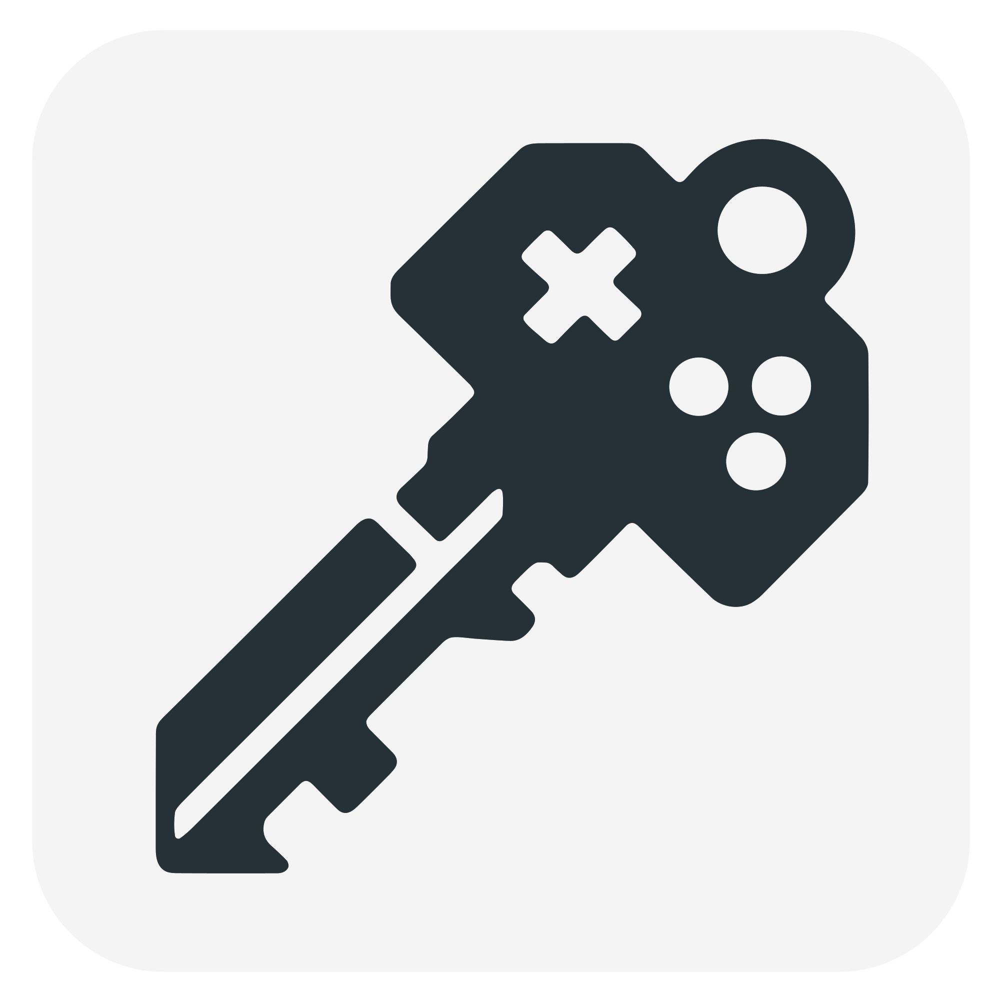

# Game Cheats Manager

English | [简体中文](./README_CN.md) | [繁體中文](./README_TW.md)

      

    

Game Cheats Manager is a one-stop solution for gamers to manage their trainers for single-player games efficiently. It allows users to browse, download, and manage all their trainers from one convenient location. Each trainer, typically a standalone executable, can be launched or deleted directly through the app, simplifying your gaming experience by keeping everything organized and accessible.

## Usage

1. **Browse Trainers**: In the left column, use the search bar or browse the list to find downloaded trainers. Double-click or click on the `Launch` button to launch a trainer; click on the `Delete` button to delete a trainer.
2. **Download Trainers**: In the right column, search with keywords and press `Enter` to get a list of available trainers. Double-click the desired match to download it directly. The trainer download path is displayed at the bottom of the right column, you can change it by clicking `...` on the right.
3. **Trainer Management**: The `Trainer Management` panel provides you with all the settings for each trainer source in one place. You can find settings like automatically updating trainers and trainer search data, or changing the download server, etc.
4. **Options**: The `Options` menu bar consists of the following functionalities:
   1. **Settings**: Adjust settings like themes and languages.
   2. **Import Trainers**: Select trainers that you want to import from the file selection window. Imported trainers are unable to auto-update.
   3. **Open Trainer Download Path**: View the trainer download folder.
   4. **Add Paths to Whitelist**: Add the trainer download path to the Windows Defender whitelist. You can do it manually if you have installed other antivirus software.
   5. **About**: View app version and project-related links.

## Installation

1. **Download the Installer**: Navigate to the [latest release](https://github.com/dyang886/Game-Cheats-Manager/releases) and download the installer for Windows (64-bit).
2. **Run the Installer**: Execute the downloaded file and follow the on-screen instructions to install Game Cheats Manager.
3. **Launch the Application**: Open Game Cheats Manager from your applications folder or start menu.

## Support

For issues, feature requests, or contributions, please visit the [GitHub repository](https://github.com/dyang886/Game-Cheats-Manager).

Below are funding options:

|                            WeChat                            |                          Alipay                          |                          QQ                          |
| :----------------------------------------------------------: | :------------------------------------------------------: | :--------------------------------------------------: |
|  |  |  |

